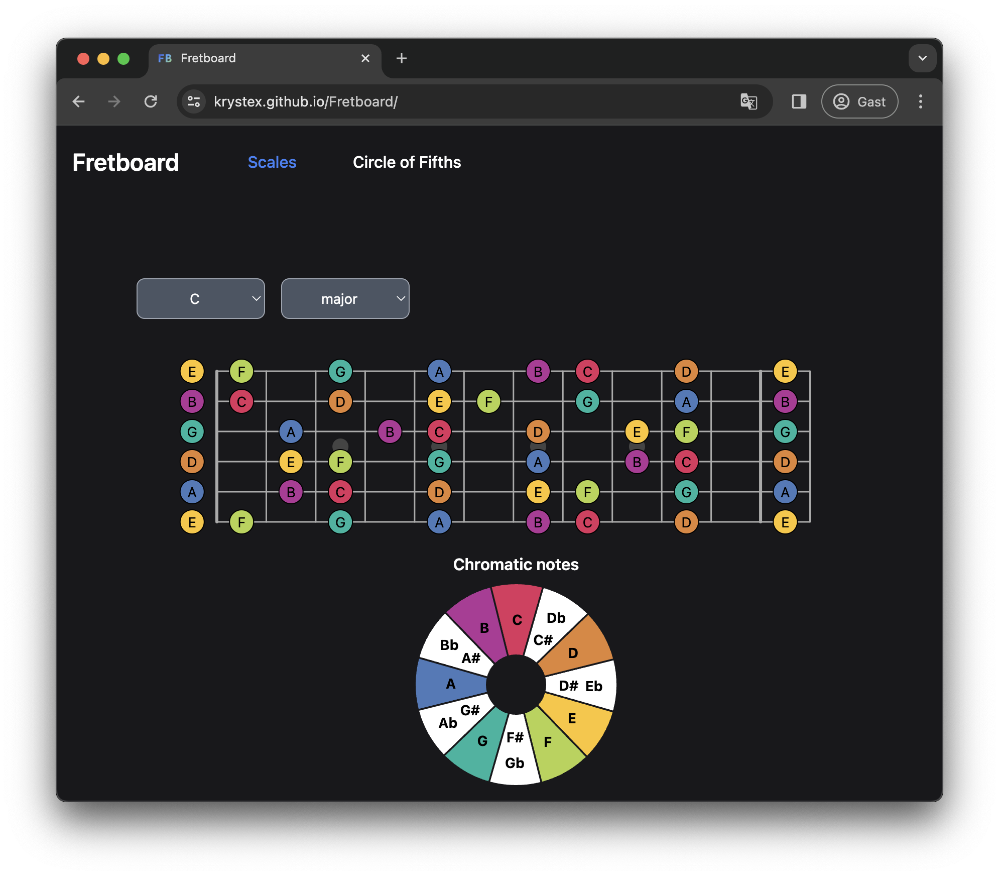

# Interactive Fretboard Visualizations

> An interactive fretboard website for learning music theory on the guitar.

You can visit it online at [https://krystex.github.io/Fretboard/](https://krystex.github.io/Fretboard/)

    

## Run Locally

To run it locally, you need NodeJS. You can install the dependencies with `npm install` and run the project with `npm run serve`. If you want to build the project and use the static files, use the command `npm run build`.

## Develop
This webapp is written in React with svg. The files are bundled with [esbuild](https://esbuild.github.io).

All the computations for music theory can be found in `src/musictheory.js`.
